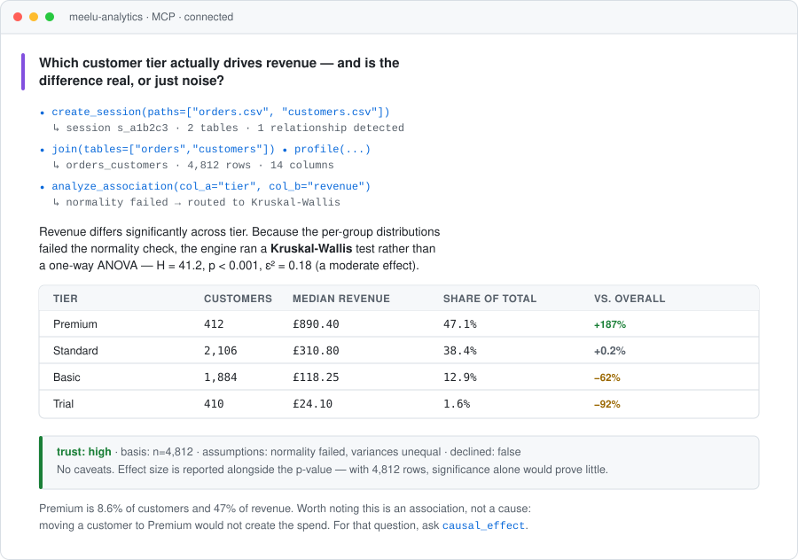

# meelu-analytics-mcp

**Deterministic single-table data analysis as a standalone MCP server.**

Load CSVs into a DuckDB-backed session, then run profiling, statistical tests,
feature engineering, machine learning, forecasting, and causal inference through
45 MCP tools — from Claude Code, or any MCP client.

The point is the *determinism*. You do not ask for a Pearson correlation; you ask
whether two columns are associated, and the engine picks the correct test from the
data's shape — checking normality, variance, and cell counts first — then records
which test it chose and why. Every result also says how much to trust it, and
refuses to answer when the data cannot support the question.

## What it looks like

Ask a question in plain language. The agent drives the tools; the engine decides
the method and reports how much to trust the answer.

<p align="center">
  
</p>

Note what the caller never had to decide: which test to run. `tier` is
categorical and `revenue` is continuous with four groups, so the routing is
determined — and because the per-group normality check failed, it lands on
Kruskal-Wallis rather than a one-way ANOVA. The result records that reasoning, in
case someone asks six months later.

## Quickstart

Four steps: start the server, connect your agent, put a CSV where the engine can
read it, then ask in English.

### 1. Start the server

Requires Python ≥ 3.10 and [`uv`](https://docs.astral.sh/uv/). There is no
separate install step — `uv run` resolves and installs dependencies on the first
invocation.

```bash
git clone https://github.com/shubham303/meelu-analytics-mcp.git
cd meelu-analytics-mcp

# This directory is both where sessions are saved AND the only place the
# engine may read data files from. Pick somewhere stable.
export TABULAR_BASE="$HOME/meelu-data"
mkdir -p "$TABULAR_BASE"

uv run --project . meelu-analytics-mcp
# → meelu-analytics-mcp listening on http://127.0.0.1:8321/mcp
```

Leave it running, and use a second terminal for the next steps.

### 2. Connect your agent

**Claude Code** — from the directory you want to work in:

```bash
claude mcp add --transport http meelu-analytics http://127.0.0.1:8321/mcp
```

Then start `claude` and run `/mcp` to confirm `meelu-analytics` is connected.

<details>
<summary><b>Claude Desktop, Cursor, and other clients</b></summary>

Most clients read a JSON config. Point them at the same URL:

```json
{
  "mcpServers": {
    "meelu-analytics": {
      "type": "http",
      "url": "http://127.0.0.1:8321/mcp"
    }
  }
}
```

For a client that prefers to launch the server itself over stdio:

```json
{
  "mcpServers": {
    "meelu-analytics": {
      "command": "uv",
      "args": ["run", "--project", "/absolute/path/to/meelu-analytics-mcp",
               "meelu-analytics-mcp", "--stdio"],
      "env": { "TABULAR_BASE": "/absolute/path/to/your/data" }
    }
  }
}
```

</details>

### 3. Put your CSV where the engine can read it

**This is the step people miss.** The engine is sandboxed to `TABULAR_BASE` — it
cannot read `~/Downloads`, your desktop, or anywhere else, and it will return an
`outside_data_dir` error naming the directory it *is* allowed to use.

```bash
cp ~/Downloads/orders.csv "$TABULAR_BASE"/
```

Copy in as many files as you like. Related tables can go in together — the engine
detects foreign keys between them on ingest. Why the sandbox exists:
[the data directory boundary](docs/configuration.md#the-data-directory-boundary).

### 4. Ask

Now just talk to your agent. You do not call the tools yourself — it does.

> Load `~/meelu-data/orders.csv` with meelu and profile it. What's in this data?

> Using meelu, is there a real relationship between `discount` and `return_rate`
> in orders.csv? Tell me which test it ran and why.

> Load orders.csv and customers.csv with meelu, join them, and tell me what
> predicts churn. Report the held-out metrics, not the training ones.

Mentioning **meelu** on the first request is usually enough to steer the agent to
these tools rather than writing its own pandas script. After that it will keep
using the session it created.

A few things worth asking for explicitly, because they are where this server
differs from an agent improvising:

- *"Which test did it choose, and what assumptions failed?"* — the routing is
  recorded in every result.
- *"What's the trust level?"* — and if a tool declined, that refusal is the
  answer. Do not let an agent paper over it with an estimate.
- *"Is that causal or just correlation?"* — most of these tools measure
  association. Only `causal_effect` attempts more, and it is honest about its
  limits.

→ **[Getting started](docs/getting-started.md)** covers the same ground in more
detail, including column typing and how to read a result.

## Documentation

| Guide | What's in it |
|---|---|
| [Getting started](docs/getting-started.md) | Install, run the server, connect an agent, first analysis |
| [Configuration](docs/configuration.md) | Environment variables, storage layout, optional extras |
| [Session model](docs/session-model.md) | Sessions, tables, the one-table rule, persistence |
| [Honesty model](docs/honesty-model.md) | Trust levels, caveats, declines — and how to read them |
| [Association test selection](docs/association-tests.md) | The deterministic routing table, in detail |
| [Architecture](docs/architecture.md) | Module layout and the dependency rules behind it |
| **[Tool reference](docs/tools/README.md)** | All 45 tools, by category |

### Tool reference by category

- [Session & workspace](docs/tools/session-and-workspace.md) — ingest, join, SQL, table building
- [Column typing](docs/tools/column-typing.md) — the typing that drives statistical routing
- [Descriptive & exploratory](docs/tools/descriptive.md) — profile, outliers, association
- [Feature engineering](docs/tools/feature-engineering.md) — deterministic column builders
- [Clustering & dimensionality reduction](docs/tools/clustering-and-dimreduction.md)
- [Supervised machine learning](docs/tools/supervised-ml.md) — train, evaluate, explain
- [Time series](docs/tools/time-series.md) — decompose, forecast, changepoints
- [Drivers & causal inference](docs/tools/drivers-and-causal.md)
- [Customer analytics](docs/tools/customer-analytics.md) — basket, RFM, cohorts

## What you get

- **45 MCP tools** over one coherent session model — data is uploaded once and
  never re-sent.
- **Deterministic method selection.** Test and algorithm choice follows from
  dtypes and assumption checks, not from an agent's guess.
- **Refusals over fabrications.** Under 30 rows, a single-valued treatment, a
  failed placebo test — the tool declines with a reason instead of returning a
  meaningless number.
- **Everything writes back.** Cluster labels, predictions, engineered features,
  PCA components all become real columns, usable by later tools and SQL.
- **In-database by default.** DuckDB/ibis does the work; nothing streams through
  the app that doesn't have to.

## Roadmap

Phases are ordered so each makes the next more useful. ✅ ships today.

| Phase | Scope | Status |
|---|---|---|
| 0 | Foundation — workspace, `Result`, dtype validation, sessions, persistence | ✅ |
| 1 | Descriptive — `profile`, `detect_outliers`, `association_matrix` | ✅ |
| 2 | Association — dtype-driven test routing (the flagship) | ✅ |
| 3 | Clustering — `cluster`, `profile_clusters`, write-back machinery | ✅ |
| 4 | Supervised — train / evaluate / predict, plus the job model | ✅ |
| 5 | Interpretation — `feature_importance`, `explain_prediction` | ✅ |
| 6 | Dimensionality reduction — PCA, t-SNE, UMAP | ✅ |
| 7 | Time series — decompose, forecast, changepoints, period comparison | ✅ |
| 8 | Insights — causal effects, key drivers, basket, RFM, cohorts | ✅ |
| 9 | MCP surface — standalone streamable-HTTP server | ✅ |

### Next

- **Large-data strategies** — sampling, out-of-core execution, approximate
  methods, so the engine degrades gracefully instead of refusing.
- **PyPI distribution** — `uvx meelu-analytics-mcp` with no local checkout.
- **Broader ingest** — Parquet and JSON alongside CSV; connector-fed tables.
- **Richer trust assessment** — replace the remaining `unassessed` results with
  real, method-specific confidence.
- **Multi-table analytics** — reduce the reliance on an explicit `join` step.

### Deliberately out of scope

Publishing, reporting, and external connectors. This engine computes; something
else decides what to do with the answer.

## Contributing

Issues and pull requests are welcome. When adding an analytic, keep the two
invariants: method selection must be deterministic and recorded in the result's
metadata, and every result must carry an honest `trust` block — including a
decline when the data cannot support the question. See
[Architecture](docs/architecture.md) for where things belong.

```bash
uv sync --extra dev --extra insights
uv run pytest
```

## Credits and license

Ported from [TableIntelligence](https://github.com/shubham303/TableIntelligence)
by the same author. Licensed under the [MIT License](LICENSE).
